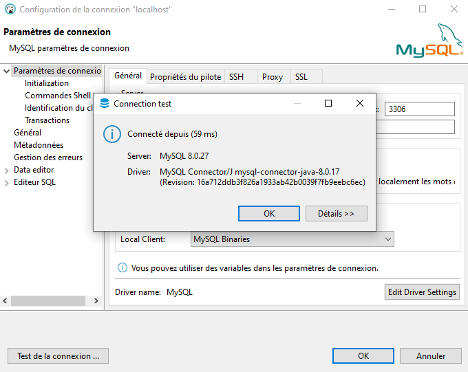

# Création d'un environnement de développement Mac OS  

Cette environnement sera constitué de Mysql, Redis.  
Et pourra être alimenté par la suite de nouveaux services à la discrétion du développeur.  

## Installation de DBeaver Community  

[DBeaver](https://dbeaver.io/) est un outil de base de données multiplateforme gratuit pour les développeurs, les administrateurs de bases de données, les analystes et toutes les personnes qui ont besoin de travailler avec des bases de données. Prend en charge toutes les bases de données populaires : MySQL, PostgreSQL, SQLite, Oracle, DB2, SQL Server, Sybase, MS Access, Teradata, Firebird, Apache Hive, Phoenix, Presto, etc.

[Télécharger DBeaver][0]

[0]: https://dbeaver.io/download/

## Téléchargement et installation de Docker  

---

Si ce n'est pas déjà fait, installer la dernière version de Docker pour Mac.  
[https://docs.docker.com/docker-for-mac/install/](https://docs.docker.com/docker-for-mac/install/)

## Création des fichiers de config applications Docker  

Par soucis de clarté, la création des fichiers de configuration seront placés dans un dossier `Development`.  
Ce qui permettra d'avoir des configurations pour d'autres étapes de développement ( Test, Production, ... )  

Ouvrir le terminal et entrer les commandes suivantes, en faisant attention de remplacer `[your_username]` par votre nom d'utilisateur Mac OS.  

```bash
mkdir /Users/[your_username]/Development
mkdir /Users/[your_username]/Development/configs
mkdir /Users/[your_username]/Development/configs/mysql
mkdir /Users/[your_username]/Development/configs/redis
mkdir /Users/[your_username]/Development/volume/mysql/data
mkdir /Users/[your_username]/Development/logs
```  

```bash
mkdir /Users/[your_username]/Development/env
```

Ce dossier sera la base de votre environnement de développement.  
  
### Configuration de Redis

<br>
  
[Redis][1] (de l'anglais `REmote DIctionary Server` qui peut être traduit par « serveur de dictionnaire distant » et jeu de mot avec Redistribute) est un système de gestion de base de données clé-valeur extensible, très hautes performances, écrit en C ANSI et distribué sous licence BSD. Il fait partie de la mouvance NoSQL et vise à fournir les performances les plus élevées possible.

[1]: https://fr.wikipedia.org/wiki/Redis

A titre informatif la configuration de Redis peut-être trouvé [ici](https://raw.githubusercontent.com/redis/redis/6.2/redis.conf).  

Nous allons maintenant créer un fichier local `redis.conf` qui contient les paramètres que nous souhaitons utiliser pour modifier la configuration à l'intérieur du conteneur du serveur Redis pendant l'exécution de Docker.  

```bash
nano /Users/[your_username]/Development/configs/redis/redis.conf
```  

Ajouter les lignes suivantes:  

```text
# bind 127.0.0.1
protected-mode yes
```  

`Control + o` pour sauver.  
`Control + x` pour sortir.  

### Configuration de Mysql

<br>
  
[MySQL][2] (prononcer [maj.ɛs.ky.ɛl]) est un système de gestion de bases de données relationnelles (SGBDR). Il est distribué sous une double licence GPL et propriétaire. Il fait partie des logiciels de gestion de base de données les plus utilisés au monde3, autant par le grand public (applications web principalement) que par des professionnels, en concurrence avec Oracle, PostgreSQL et Microsoft SQL Server.

[2]: https://fr.wikipedia.org/wiki/MySQL

A titre informatif la configuration de Redis peut-être trouvé [ici](https://raw.githubusercontent.com/redis/redis/6.2/redis.conf).  

Nous allons maintenant créer un fichier `my.cnf` qui contiendra un seul paramètre qui configurera notre instance de serveur MySQL 8 pour qu'elle s'exécute en utilisant l'authentification par mot de passe natif plutôt que le mot de passe par défaut caching_sha2_password.  

```bash
nano /Users/[your_username]/Development/configs/mysql/my.cnf
```  

Ajouter les lignes suivantes:  

```text
[mysqld]
default-authentication-plugin=mysql_native_password
```  

`Control + o` pour sauver.  
`Control + x` pour sortir.  

## Création d'un réseau virtuel Docker  

Docker a un DNS intégré. Nous allons donc créer un réseau local pour nos conteneurs Docker. En faisant cela, tous nos conteneurs pourront communiquer entre eux par nom plutôt que par IP tant que tous les conteneurs sont ajoutés au même réseau. Tous les conteneurs de mes exemples feront partie du même réseau.
Vous pouvez nommer votre réseau comme vous le souhaitez. Puisque nous construisons un environnement de développement, je l'appellerai dev-network.  

```bash
docker network create dev-network
```

## Création de la stack avec docker-compose  

Pour tester le fonctionnement de la stack, nous utiliseront [docker-compose][3] qui nous permettra d'intéragir et de retrouver toutes les infos de nos containers au même endroits.  

[3]: https://docs.docker.com/compose/  

En supposant que vous ayez déjà une application node js prête à l'emploi dans votre dossier. Il suffit de créer un fichier `docker-compose.yaml` à la racine du dossier d'environnement de dev.  

```bash
nano /Users/[your_username]/Development/env/docker-compose.yaml
```

Ajouter le contenu suivant:

```yaml
version: '3'

################################################################################
# NETWORKS
################################################################################
networks:
  dev-network-01:             # Network name given  for this stack
    external:
      name: dev-network       # Network pre existing name Compose has to look to connect your app's container

################################################################################
# SERVICES
################################################################################
services:
  dev_env:
    container_name: dev_env
    image: node:14
    command: bash -c 'npm i && npm run watch'   # Depending of the scripts in your package.json
    ports:
      - '4000:4000'
    environment:
      NODE_ENV: development
    volumes:
      - .:/usr/src/service
    working_dir: /usr/src/service
  mysql:
    container_name: mysql
    image: mysql:8.0

    environment:
      MYSQL_ROOT_PASSWORD: random_root_password
      MYSQL_USER: your_mysql_username
      MYSQL_PASSWORD: your_mysql_password
    ports:
      - '3306:3306'
    volumes:
      - /Users/[your_username]/Development/volume/mysql/data:/var/lib/mysql
      - /Users/[your_username]/Development/configs/mysql:/etc/mysql/conf.d
    restart: always
    networks:
      - dev-network-01

  redis:
    container_name: redis
    image: redis:6.2

    ports:
      - '6379:6379'
    volumes:
      - /Users/[your_username]/Development/configs/redis/redis.conf:/usr/local/etc/redis/redis.conf
    restart: always
    networks:
      - dev-network-01
```

Ensuite lancer dans le terminal la commande suivante:

```bash
docker-compose up -d
```

Puis lancer la commande suivante pour accéder au log de l'application:

```bash
docker-compose logs -f <nom du container>
```

  

Après quelques secondes, tous nos services devraient être en cours d'exécution. Voyons donc, par exemple, comment accéder à la base de données sur DBeaver

### 1. Créer la connection à la base de données

  
Cliquer sur le bouton pour démarrer la connection à la base de données.  

  

+ 1. Sélectionner le type de base de données (ici MySQL).

+ 2. Cliquer suivant pour passer au paramaétrage de la connexion.

  

+ 1. Renseigner le port de connexion identique à celui entré sur le fichier `docker-compose.yaml` (Par défaut `3306`).

+ 2. Renseigner les credentials identiques à ceux entrés sur le fichier `docker-compose.yaml`.

+ 3. Finalement tester la connexion et valider le paramétrage si tout est OK.

Le résultat devrait ressembler à ceux-ci:



On peut maintenant interagir avec la base de données:

  
